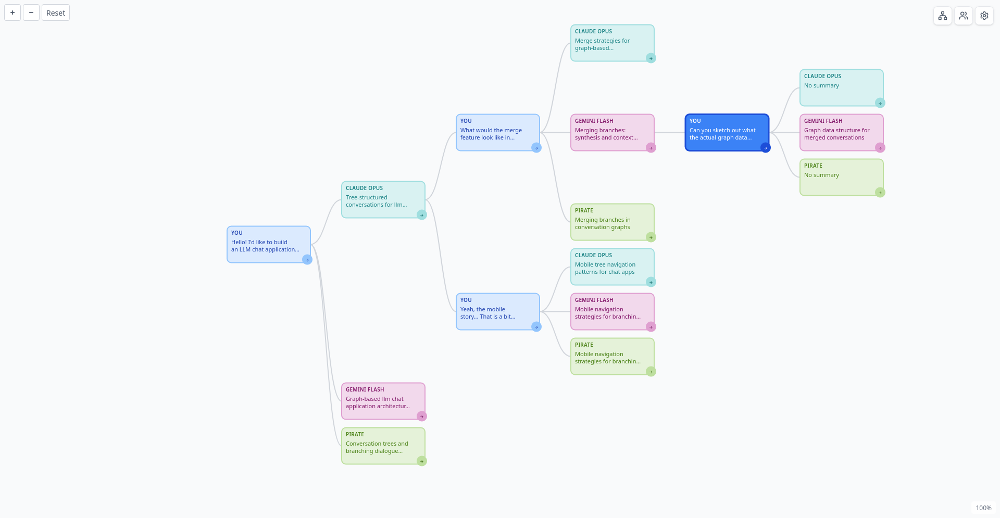
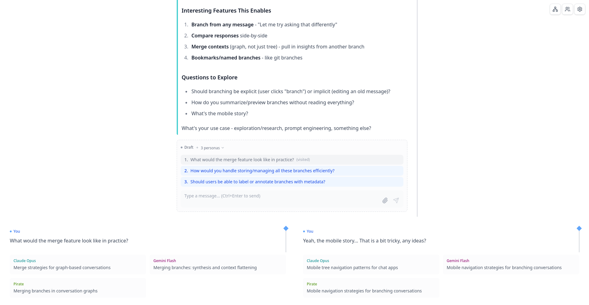

# Figments
LLMs are not humans, so why do we chat with them as if they were?


Figments is a bit different take on AI chat applications. Instead of
linear conversations, it uses trees (acyclic graphs) for modelling
chats/spaces. This allows you to reply to a single LLM message 
multiple times... *and* multiple LLMs to reply to your every message,
should you wish so.



To be honest, I'm not sure how useful this is in practice.
But it is pretty cool!

**Disclaimer:** Figments is an early prototype, and I'm not *really* a web
developer by trade. Please expect bugs and questionable architectural choices!

**Disclaimer:** Figments has been my sandbox project for Claude Code and
OpenCode testing. I've not kept exact track, but in general:
* All database schemas have been designed by me
* Most of the backend was written by me without AI assistance
* Most of the frontend code is originally LLM-generated,
  though it has received heavy editing from me
* This README is entirely human-written

All LLM-generated code has been reviewed by me. This is not to say Figments
would be bug-free or even necessarily architecturally sound.
On the contrary, I am not a full stack web developer by trade!

In classic open source fashion, if it breaks, you can keep the pieces.

## Features
Aside of the slightly unorthodox UI, Figments has:
* A realtime sync engine built on [y-query](github.com/bensku/y-query)
  * LLM messages stream as they're generated
  * If you refresh the page, things that were streaming don't disappear!
  * Data is persisted on S3-compatible object storage
* Support for Anthropic, OpenAI and OpenRouter LLM APIs
  * Any OpenAI-compatible provider will *probably* work, but thinking traces might be broken
* Ability to switch models *and* providers mid-conversation
* Optional automatic generation of potential user replies
* File uploads
* Provider-provided tools, such as Anthropic's web search
* Native (and supposedly more reliable) citations on Anthropic models

Planned:
* Better (and more documented) authentication
* Figments-provided tools
* Non-S3 storage options

## Installation
Until I sort out the authentication, a local install is highly recommended.

You'll need the following:
* [Bun](https://bun.com/) Javascript runtime
* An S3-compatible object storage bucket
  * For local testing, Localstack is available with `docker-compose`

To install JS/TS dependencies, run:
```sh
bun install
```

And to start it:
```sh
docker-compose up -d # If you want to use LocalStack
bun dev # Development mode with HMR
bun run # "Production" mode
```

See below for configuration instructions.

## Configuration
Instance settings, available LLMs and personas (called presets in UI) are
configured in `figments.toml`. See `figments.dev.toml` for an annotated sample
configuration that also works out of the box.

You'll also need to specify the secrets for LLM providers and object storage
access with environment variables. For local usage, using a `.env` file
is highly recommended! For example of what works with `figments.dev.toml`,
see `.env.example`.

## License
AGPL.